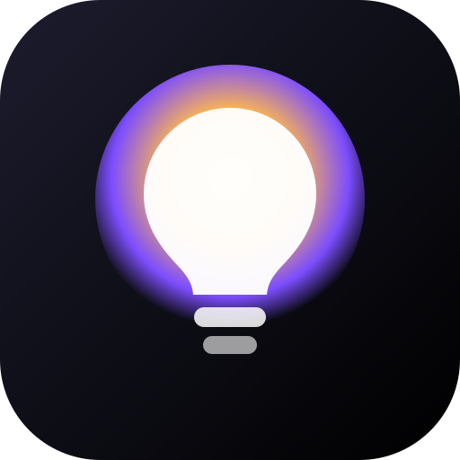

# 💡 Huis Verlichting

Een Apple-Home-achtige web-app (PWA) om je **MiBoxer**- (via Tuya) en
**Philips Hue**-verlichting in het hele huis en de tuin te bedienen: kleuren,
helderheid, kleurtemperatuur en scènes — met eigen namen en kamers in plaats
van "Zone 5".

De app werkt **direct in demo-modus** zodat je alles kunt uitproberen. Zodra je
je Tuya- en/of Hue-gegevens invult (Instellingen ⚙️) stuurt hij je échte lampen
aan.



---

## Wat kan de app

- 🎨 **Kleur, helderheid en kleurtemperatuur** per lamp via een Apple-stijl
  kleurenwiel en sliders.
- 🏠 **Kamers en eigen namen** — noem een zone "Sfeer achter TV" in plaats van
  "Zone 2".
- 🎬 **Scènes** — bijv. *Avond*, *Film*, *Tuin aan*, *Alles uit*.
- 🔌 **MiBoxer (Tuya)** én **Philips Hue** in dezelfde app.
- 📱 **Installeerbaar** op je iPhone-beginscherm (fullscreen, voelt als een app).

---

## Belangrijk om te weten (hardware)

- Je MiBoxer-**gateway is een Tuya-apparaat** (de device-id's beginnen met `bf`).
  We besturen hem daarom via **Tuya**, niet via het oude MiLight-protocol.
- De **max. 8 zones** en "geen losse lampen" zijn een beperking van het
  **2,4 GHz-systeem van MiBoxer zelf**. Alle lampen die op dezelfde zone gekoppeld
  zijn, doen exact hetzelfde. Losse aansturing kan alleen als elke lamp een eigen
  zone krijgt (max. 8 per FUT089-gateway). Deze app kan dat niet omzeilen — wél
  kan hij zones nette namen geven en overzichtelijk maken.
- **Philips Hue** kan wél per lamp individueel (via de Hue Bridge).

---

## Snel starten (ontwikkelen)

```bash
npm install
npm run dev        # http://localhost:3000
```

Productie:

```bash
npm run build && npm start
```

> **Waar hosten?** Voor **Hue** moet de app op je **thuisnetwerk** draaien
> (bijv. een Raspberry Pi, oude laptop of NAS), omdat de Hue Bridge alleen
> lokaal bereikbaar is. **MiBoxer/Tuya** werkt óók vanuit de cloud.
> Een praktische opzet: draai de app op een klein apparaatje thuis en zet 'm op
> je iPhone-beginscherm.

### Op je iPhone zetten

1. Open het adres van de app in **Safari**.
2. Deel-knop → **Zet op beginscherm**.
3. Open 'm vanaf het beginscherm — hij draait fullscreen.

---

## MiBoxer koppelen (Tuya Cloud)

Eenmalig instellen:

1. Ga naar **[iot.tuya.com](https://iot.tuya.com)** en maak een gratis account.
2. **Cloud → Development → Create Cloud Project** (kies je regio, bijv. *Central
   Europe*). Noteer de **Access ID** en **Access Secret**.
3. Ga in het project naar **Devices → Link App Account** en scan de QR-code met
   je **Smart Life / MiBoxer / Tuya**-app. Nu ziet het project je apparaten.
4. **Cloud → Service API**: voeg *IoT Core* toe (meestal standaard actief).
5. Open in de app **Instellingen ⚙️ → MiBoxer**, kies je regio, plak **Access
   ID** en **Access Secret**, en tik **Verbinding testen**. Je ziet dan je
   apparaten verschijnen.
6. Zet **Demo-modus uit** om echt te sturen.

**Zones/lampen koppelen.** Elke lamp in de app verwijst naar een Tuya
`device-id` (+ evt. een zone 1–8). Bij *Verbinding testen* zie je de juiste
device-id's. Voeg lampen toe via de **+** naast een kamer, of pas de
voorbeeldlampen aan.

> **DP-codes.** De app gebruikt de standaard Tuya-lichtcodes (`switch_led`,
> `work_mode`, `bright_value_v2`, `temp_value_v2`, `colour_data_v2`). Reageert
> een apparaat niet zoals verwacht, dan kun je de exacte codes opzoeken via
> *Instellingen → Verbinding testen* (specificaties) en per lamp overschrijven
> in `ref.dp`.

---

## Philips Hue koppelen

1. Zorg dat de app op je thuisnetwerk draait.
2. **Instellingen ⚙️ → Philips Hue → Zoek** (vindt de Bridge automatisch), of
   vul het IP handmatig in.
3. Druk op de **ronde link-knop** boven op de Hue Bridge en tik binnen 30
   seconden op **Koppel**.
4. Tik **Hue-lampen importeren** — al je Hue-lampen komen in de kamer *Hue* en
   je kunt ze verslepen/hernoemen.

---

## Techniek

- **Next.js 14** (App Router) + React, TypeScript.
- Alle bediening loopt via eigen **API-routes** (`/api/tuya/*`, `/api/hue/*`).
  De Tuya-verzoeken worden server-side ondertekend (HMAC-SHA256); Hue gebruikt de
  lokale Bridge-API (v1).
- Kamers, lampen, scènes en instellingen worden **lokaal** op je apparaat
  bewaard (localStorage). Je Tuya/Hue-sleutels blijven op je eigen
  apparaat/server.

```
src/
  app/            pagina + API-routes
  components/     UI (tegels, kleurenwiel, sliders, sheets)
  lib/            datamodel, kleur-utils, store, backend-adapters
  lib/server/     Tuya-ondertekening + Hue-client
```

---

## Roadmap-ideeën

- Live status ophalen (nu stuurt de app; terugkoppeling van de echte stand kan
  erbij).
- Lampen slepen tussen kamers, kamer-iconen kiezen in de UI.
- Widgets/scènes op tijd (timers), en groepen over kamers heen.
- Optioneel lokale Tuya-besturing (LocalTuya) voor snelheid zonder cloud.
