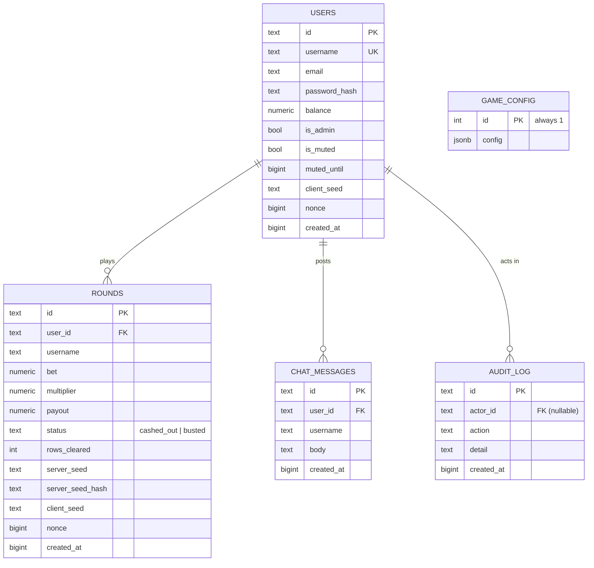

# Glass Bridge — Data Model (ER Diagram)

## Notes

- **users.nonce** increments after every finalized round, guaranteeing each
  round under a `(server_seed, client_seed)` pair uses fresh entropy.
- **rounds** stores the *revealed* `server_seed` plus its pre-published
  `server_seed_hash`, so any historical round is independently verifiable.
- Monetary columns use `NUMERIC` to avoid floating-point drift on balances.
- **game_config** is a single-row table holding the live multiplier ladder,
  house edge and bet limits set from the admin panel.
- Timestamps are epoch milliseconds (`BIGINT`) for portability between the
  in-memory and PostgreSQL stores.
