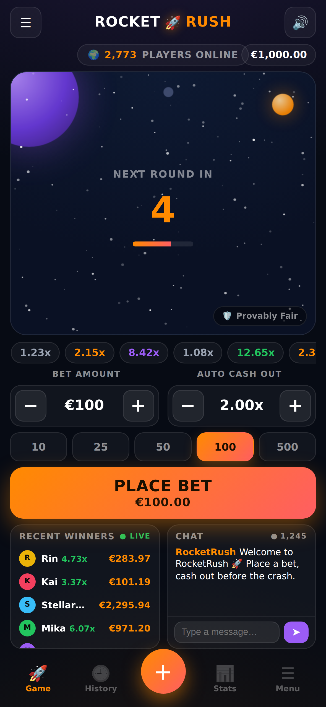
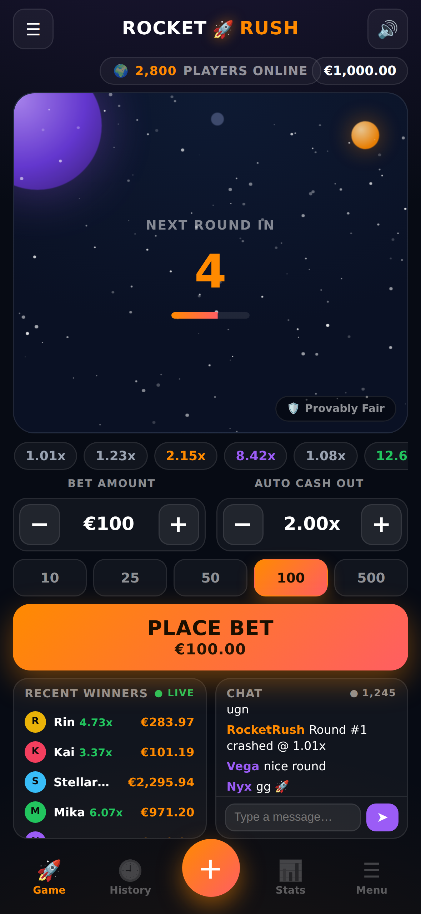
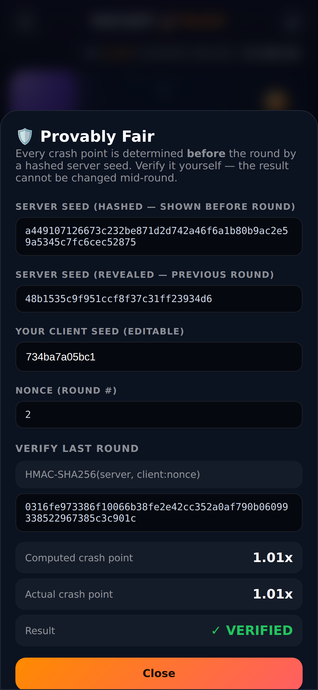
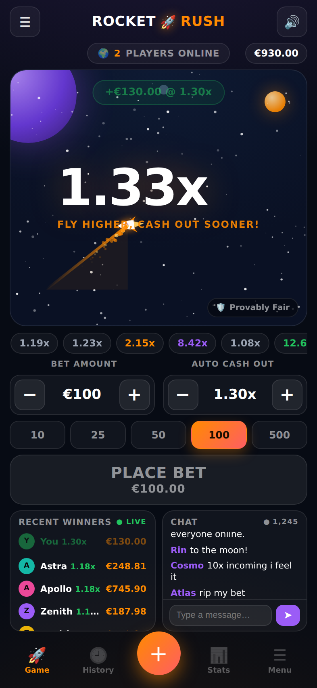
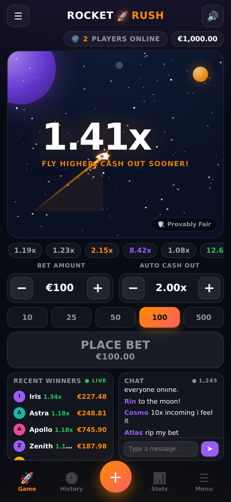
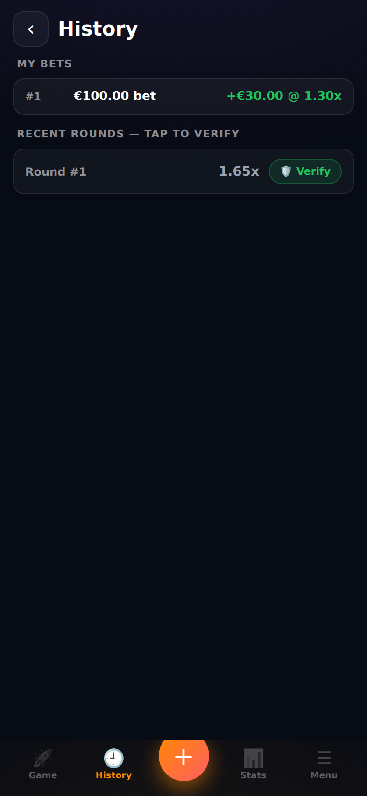
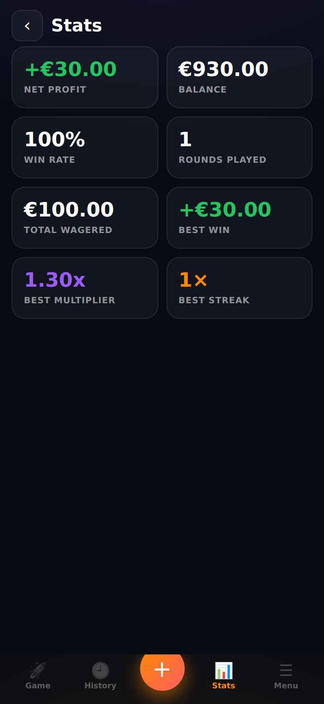
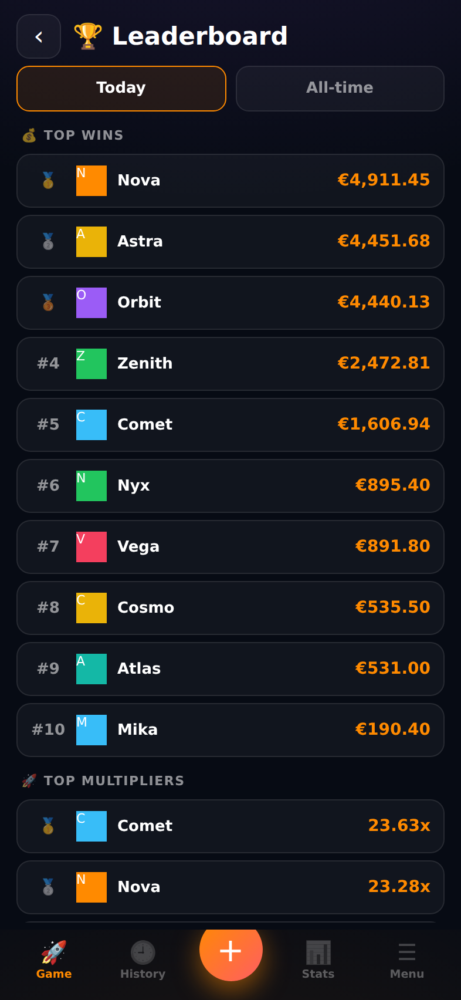
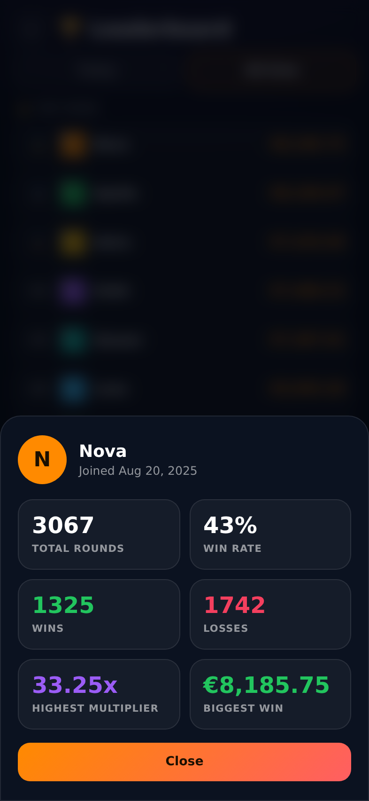
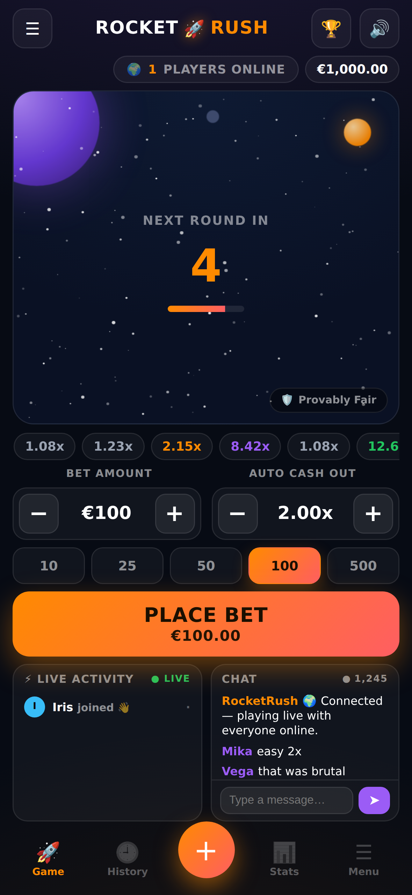

# 🚀 RocketRush

**The Apple of crash games.** Simple. Fast. Premium. Instantly understandable.

A mobile-first **multiplayer** crash game. Place a bet → watch the rocket rise →
cash out before it crashes. A new player understands it in 3 seconds.

This is a **real, runnable app with a real backend** — not a design concept.
An authoritative Node + Socket.io server runs one shared round clock for every
player; the Next.js client renders it. Two commands and you're playing it on
your iPhone.

---

## ⚡ Quick start (2 commands)

```bash
npm install
npm run dev          # single-origin: the app + realtime game on one port (3000)
```

Then open **http://localhost:3000** on your computer. The Next.js app and the
Socket.io game run on **one origin/port** (`server.mjs`) — **no database, no API
keys, no config**, and it deploys as a single web service (see
[Deploy](#-deploy-public-url)).

**It's truly multiplayer:** open the URL on your **phone and your laptop at the
same time** (same WiFi) and you'll share the exact same rocket, round, and crash —
with a live online count, shared winners feed and chat.

> **Always playable.** If the game server isn't reachable, the client
> automatically falls back to a local simulation so the game never gets stuck.
> The single-file `index.html` is a pure-local version you can open with no
> install at all.

> **Accounts are optional.** Without Supabase keys the game runs in **guest
> mode** (progress saved per browser/device). Add Supabase to enable real
> accounts that sync across devices — see [Accounts](#-accounts-optional) below.

### How it looks (iPhone 16 Pro)

| Betting / countdown | Rocket rising | Provably fair |
|---|---|---|
|  |  |  |

**Live multiplayer** — note `2 PLAYERS ONLINE` (the real shared count) and a
server-paid cashout. These are two separate browsers in one round:

| Player A (live) | Player B (same round) |
|---|---|
|  |  |

**History & Stats** (bottom nav) — your bet outcomes, verifiable round history,
and live stats (net profit, win rate, best multiplier, streaks):

| History | Stats |
|---|---|
|  |  |

**Social — leaderboard, public profiles & live activity** (tap any player
anywhere to open their profile):

| Leaderboard | Public profile | Live activity |
|---|---|---|
|  |  |  |

Built to match the product mockup: `ROCKET🚀RUSH` lockup, players-online pill,
space stage with planets, dominant multiplier + "FLY HIGHER, CASH OUT SOONER!",
preset bet chips, the big orange **Cash Out**, split Winners/Chat panels, and a
bottom tab bar (Game · History · Bet · Stats · Menu).

---

## 📱 Test on your iPhone (same WiFi) — the whole point

Your phone and your computer must be on the **same WiFi network**. The dev server
already listens on every network interface (`-H 0.0.0.0`), so you only need your
computer's local IP address.

### On macOS — find your local IP
- **Quickest:** hold **⌥ Option** and click the **WiFi icon** in the menu bar →
  it shows `IP Address: 192.168.x.x`.
- **Or Terminal:**
  ```bash
  ipconfig getifaddr en0     # WiFi
  # if that's empty, try: ipconfig getifaddr en1
  ```

### On Windows — find your local IP
- **Command Prompt / PowerShell:**
  ```powershell
  ipconfig
  ```
  Look under your WiFi adapter for **IPv4 Address** → `192.168.x.x`.
- One-liner (PowerShell):
  ```powershell
  (Get-NetIPAddress -AddressFamily IPv4 | Where-Object {$_.PrefixOrigin -eq 'Dhcp'}).IPAddress
  ```

### Then, on your iPhone
Open **Safari** and go to:

```
http://YOUR_IP:3000
```

**Example:** `http://192.168.1.100:3000`

You'll see the full game. **Tap the Share button → Add to Home Screen** to install
it as a PWA — it launches full-screen like a real App Store app.

> **Provably-fair works over LAN too.** WebCrypto (`crypto.subtle`) is blocked on
> plain `http://` outside localhost, so the game ships a pure-JS SHA-256 + HMAC
> fallback that's byte-identical to WebCrypto. Verified against Node's crypto in
> `verify-fairness.mjs`.

### Troubleshooting LAN access
| Symptom | Fix |
|---------|-----|
| Page won't load on iPhone | Same WiFi? Some routers enable "AP/client isolation" — disable it, or use a phone hotspot for both devices |
| macOS firewall prompt | Allow incoming connections for `node` |
| Shows "Offline mode" in chat | The client couldn't reach the server. Make sure `npm run dev` is running and port 3000 isn't blocked by your firewall (the game falls back to a local simulation either way) |
| Windows can't connect | Set the WiFi network to **Private**, or allow Node.js through Windows Defender Firewall |
| Wrong IP | Pick the `192.168.*` / `10.*` address, not `127.0.0.1` |

---

## 🚀 Deploy (public URL)

Because the app and the realtime game share **one origin/port**, RocketRush
deploys as a single web service — give testers a public HTTPS URL they can open
on any phone, no local machine needed.

```
Build:  npm install && npm run build
Start:  npm start            # node server.mjs --prod  (binds $PORT)
Health: GET /
```

- **Render** — New → Blueprint (uses `render.yaml`), or a Node web service with
  the build/start commands above. WebSockets work on all plans.
- **Railway** — Deploy from repo (Nixpacks or the included `Dockerfile`), then
  generate a domain.
- **Any Docker host** — `docker build -t rocketrush . && docker run -p 3000:3000 rocketrush`.

Without Supabase keys the public build runs in **guest mode** — fully playable
and shareable. Full step-by-step (env vars, persistence notes) →
**[`docs/DEPLOY.md`](docs/DEPLOY.md)**.

---

## ✨ What's in the prototype

Everything below works right now, client-side:

- 🚀 **Animated rocket** on a live starfield with an exhaust trail + crash explosion
- 📈 **Increasing multiplier** — the largest element on screen, color-escalates
  white → orange → purple → green as it climbs
- 🎯 **Place bet** with − / amount / + and ½ · 2× · MAX quick-picks
- 💸 **Cash Out button** — full-width, breathing glow, shows your **live return**
- 🤖 **Auto cashout** at a target multiplier (OFF · 2x · 10x presets)
- 🕒 **Recent multipliers** as color-tiered pills
- 🏆 **Recent winners** (max 10, your wins highlighted)
- 👥 **Online players** counter
- 💬 **Live chat** mockup (collapses into a tab on mobile)
- 🕘 **History screen** — your bets (win/loss) + verifiable round history
- 📊 **Stats screen** — net profit, win rate, best multiplier, streaks
- 💾 **Persistent progress** — balance, history & stats survive refresh (and
  server restart)
- 👤 **Accounts** (optional, Supabase) — register / login / logout / profile,
  so your progress follows you across devices
- 💳 **Demo wallet** — €1,000 play money, transaction history, reset balance
- 🏆 **Leaderboard** — top wins & top multipliers, today & all-time
- ⚡ **Live activity feed** — wins, big multipliers and joins, in real time
- 🪪 **Public profiles** — tap any player to see their stats
- 🛡️ **Provably Fair** verifier — tap the badge to verify any round
- 🔊 Procedural sound, 🌐 6 languages, ♿ low-bandwidth mode, 📲 PWA install

Rounds are **driven by the authoritative server** (5s betting → launch → rising →
crash → repeat) and shared by everyone connected. Bots keep the room lively when
you're the only human. If the server is unreachable, the same loop runs locally.

---

## 📐 Mobile-first design (85% mobile / 15% desktop)

Designed for **iPhone 15 Pro · 16 Pro · 16 Pro Max** first. Everything fits on one
screen with **no zoom** (`viewport-fit=cover`, safe-area insets, `user-scalable=no`).

The three things that matter own the screen:

```
1. ROCKET        (hero animation)
2. MULTIPLIER    (dominant, center)
3. CASH OUT      (impossible to miss, thumb zone)
```

On mobile, Winners and Chat collapse into bottom tabs so the stage never shrinks.
On desktop (≥901px) they expand into side panels — same code, no redesign.

### Performance
- **60 FPS** via a single `requestAnimationFrame` canvas loop; the React tree
  renders **once** and never re-renders (the engine updates the DOM imperatively).
- **No heavy libraries** — Next + React + Socket.io only. No animation framework,
  no UI kit. First load ≈ **110 kB**. The 60fps loop is hand-rolled canvas.
- Low-bandwidth mode drops star/particle counts for older devices.

---

## 🗂 Folder structure

```
rocketrush/
├─ app/
│  ├─ layout.tsx          # html shell, mobile viewport + PWA metadata
│  ├─ page.tsx            # the game screen (static JSX, rendered once)
│  ├─ game-engine.ts      # client: rendering, controls, net client, auth + local fallback
│  ├─ lib/supabase.ts     # browser Supabase client (null → guest mode)
│  └─ globals.css         # design system + responsive layout (one file)
├─ server.mjs            # single-origin server: serves Next + Socket.io on one port
├─ server/
│  ├─ game-server.mjs     # authoritative game logic, attachGame(io) (shared rounds)
│  ├─ store.mjs           # data store: JSON (guests) / Supabase Postgres (accounts)
│  └─ social.mjs          # leaderboard, public profiles & live activity feed
├─ Dockerfile, render.yaml # deploy (see docs/DEPLOY.md)
├─ supabase/
│  └─ schema.sql          # wallets, stats, bets, transactions + RLS
├─ .env.example           # Supabase keys (copy to .env.local to enable accounts)
├─ public/
│  ├─ manifest.webmanifest, icon.svg   # PWA install
├─ index.html             # the same game as a zero-install single file (local-only)
├─ verify-fairness.mjs    # provably-fair verifier (run: npm run verify)
├─ docs/                  # full architecture & design deliverables
├─ package.json           # scripts: dev / build / start / verify
├─ next.config.js
└─ tsconfig.json
```

### How multiplayer works (MVP)

The game logic (`server/game-server.mjs`) owns one round clock for everyone:
decides the crash point **before** each round (provably fair), broadcasts
`betting → start → crash`, validates every bet/cashout, and owns each player's
balance. It's attached to the **same HTTP server** that serves the app
(`server.mjs`), so the client connects **same-origin** — identical on localhost,
your LAN (iPhone), and a public HTTPS host. This is the real product loop — it
maps 1:1 to the NestJS `GameGateway` in [`docs/02`](docs/02-architecture.md);
kept as plain Node + Socket.io so the whole thing runs with one command.

**Verified end-to-end** with two real browsers in one room: shared online count,
a server-paid cashout, and the client verifying a live round's crash point
against the server seed (`✓ VERIFIED`).

### Persistence

Your **balance is server-authoritative and persisted** keyed by a stable
`playerId` (stored in your browser, sent on connect). The server keeps balances
in `server/.data/balances.json` (gitignored) so progress survives both a refresh
and a server restart — no database needed for the MVP (maps to the wallet table
in [`docs/03`](docs/03-data-and-api.md)). Your **history & stats** persist in the
browser (`localStorage`). If you ever hit €0 you get a free re-up, and
**Settings → Reset balance** sets it back to €1,000. Verified: play → refresh →
balance/history/stats restored.

### 👤 Accounts (optional)

Out of the box the game runs in **guest mode** (no login; progress saved per
device). To make progress follow a user **across devices** (laptop ↔ iPhone),
enable Supabase — it stays the simple MVP, no real-money rails.

**What you get:** Register · Login · Logout · Forgot-password (placeholder) ·
Profile, plus a **demo wallet** (€1,000 start, transaction history, reset). The
**game server is authoritative** — it verifies the Supabase token and stores
each user's balance, stats, bets and transactions in Supabase Postgres, then
pushes them to every device the user is logged in on. The client never controls
the balance.

**Setup (~5 min):**
1. Create a project at [supabase.com](https://supabase.com).
2. In the SQL editor, run [`supabase/schema.sql`](supabase/schema.sql) (wallets,
   stats, bets, transactions + row-level security).
3. (Optional) Auth → Providers → Email: turn **off** "Confirm email" for instant
   sign-in during testing.
4. Copy `.env.example` → `.env.local` and fill in:
   ```bash
   NEXT_PUBLIC_SUPABASE_URL=...        # Settings → API → Project URL
   NEXT_PUBLIC_SUPABASE_ANON_KEY=...   # Settings → API → anon public key
   SUPABASE_URL=...                    # same Project URL (for the game server)
   SUPABASE_SERVICE_ROLE_KEY=...       # Settings → API → service_role key (server only!)
   ```
5. `npm run dev` — tap the **balance** (or Settings → Account) to register/login.

> The `service_role` key is server-only — it's read by `server/game-server.mjs`
> and **never** shipped to the browser. The browser only uses the public anon
> key. Guests still work alongside accounts.

**Verified:** the entire account data path (server-authoritative balance, stats,
bet history and transactions pushed to the client, plus reset) is exercised by
guest mode in CI-style checks — the Supabase store is a drop-in with the same
interface, so accounts use the identical, tested flow.

### 🏆 Social layer

`server/social.mjs` keeps a small global state (one JSON file) powering:
- **Leaderboard** — top 10 wins and top 10 multipliers, **today** and **all-time**
  (updated on every cashout; today resets at UTC midnight).
- **Public profiles** — username, join date, total rounds, wins, losses, win
  rate, highest multiplier and biggest win. Every event carries a `pid`, so
  tapping a player in the **activity feed, leaderboard or chat** opens their
  profile card.
- **Live activity feed** — `win`, `bigmult` (≥10x) and `join` events broadcast to
  everyone. Bots play, win and join so it feels alive even when you're solo.

All of it is server-pushed over the existing Socket.io connection — no polling,
no extra deps. Verified live: feed fills + is clickable, leaderboard (today &
all-time) populates, and tapping an entry opens a 6-stat profile card.

---

## 🧪 Commands

| Command | What it does |
|---------|--------------|
| `npm install` | Install deps |
| `npm run dev` | Single-origin dev server (app + game) on port 3000, LAN-accessible |
| `npm run build` | Production build |
| `npm start` | Production single-origin server (`node server.mjs --prod`) |
| `npm run verify` | Run the provably-fair verifier over 200k rounds |

## ✅ Verify fairness yourself

```bash
npm run verify
```

Runs the **same** crash algorithm the game uses across 200k rounds and prints the
distribution + house edge. In the game, tap the 🛡️ badge to verify any single
round (server seed → client seed → nonce → HMAC → crash point → ✓ VERIFIED).

---

## 🛣 Production Roadmap

This prototype is the **client of record** — the production app keeps this exact
UI and swaps the client-side simulation for an authoritative server.

| Phase | Theme | Highlights |
|-------|-------|-----------|
| **Now — MVP** | Real multiplayer | This app: authoritative Socket.io server, shared rounds, provably fair, mobile-first, PWA |
| **P1 — Harden the backend** | Production server | Port `server/game-server.mjs` to the NestJS `GameGateway` (`docs/02`), add Redis adapter + leader election for multi-node |
| **P2 — Accounts & wallet** | Real money loop | Auth + 2FA, double-entry ledger, atomic idempotent bet/cashout (`docs/03`) |
| **P3 — Scale realtime** | Concurrency | Redis Socket.io adapter, leader-elected engine, sticky WSS, HPA (`docs/04`) |
| **P4 — Data backbone** | Analytics & risk | Kafka stream → ledger, analytics, fraud, payout consumers |
| **P5 — Operator dashboard** | Ops & compliance | Online, GGR, retention, regions, round stats, white-label, i18n |
| **P6 — Trust & safety** | Integrity | Bot/fraud detection, rate limits, DDoS posture, audit logging (`docs/05`) |
| **P7 — Responsible gaming** | Compliance | Deposit/session limits, reality checks, self-exclusion, cooling-off (`docs/05`) |
| **P8 — Modular social** | Retention | Friends, clans, tournaments, seasons — **separate surfaces**, never cluttering the 3-second main screen |

Full architecture (DB schema, REST + WebSocket APIs, security, compliance,
scalability, design system, component library) lives in [`docs/`](docs/).

---

## Design principles (non-negotiable)
- **KISS.** Multiplier dominates. Cash Out is impossible to miss. Everything else
  is quieter. A new player gets it in 3 seconds.
- **Mobile-first**, one-thumb, 60 FPS, no-zoom, PWA-ready.
- **Transparent.** Every round is provably fair and independently verifiable.
- **Not Aviator.** Calmer motion, more whitespace, its own identity.
