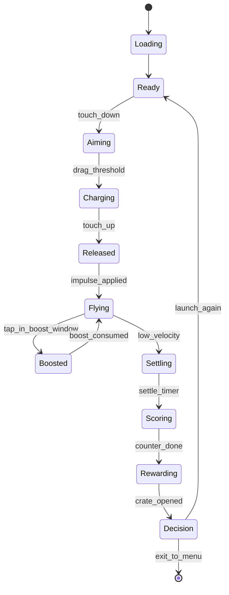

# 02 — Gameplay Loop Architecture

A mobile game lives or dies by how *cleanly nested* its loops are. We design three:

```
  ╭──────── 7-day Meta Loop ────────╮
  │  Battle pass / prestige / shop  │
  │  ╭──── 5-min Session Loop ────╮  │
  │  │  3-7 runs, missions tick   │  │
  │  │  ╭── 60-90s Run Loop ──╮   │  │
  │  │  │ aim → fly → land →  │   │  │
  │  │  │ crate → restart     │   │  │
  │  │  ╰─────────────────────╯   │  │
  │  ╰────────────────────────────╯  │
  ╰──────────────────────────────────╯
```

## 1. The 10-Second Loop (Onboarding & Hook)

Mobile users decide in **8 seconds** whether to keep playing. Storyboard:

| Frame | Time | Event |
|---|---|---|
| 1 | 0.0 s | Game opens → directly into a pre-set "easy biome". No splash beyond logo (1 s). |
| 2 | 1.0 s | Finger animation pulses the projectile. Diegetic prompt: "DRAG ME". |
| 3 | 2.0 s | Player drags. Slingshot bands stretch with rubber-shader squash. |
| 4 | 3.5 s | Release. Camera punches in, slow-mo 0.2 s, *thwock* sample. |
| 5 | 4.5 s | First bounce on guaranteed mega-pad — projectile rockets up. Confetti rain. |
| 6 | 6.0 s | Combo counter explodes from x1 → x4 with chiptune escalator. |
| 7 | 9.0 s | Lands ~400 m in. Stat card flies in: "+1,200 COINS, NEW PB!". |
| 8 | 10.0 s | Crate explodes open, drops a new projectile skin. Player feels rich. |

**Design contract:** if the player has not smiled by 10 s, the FTUE failed. Track via session telemetry (drop-off curve).

## 2. The 60-Second Run Loop

```
[AIM (3–6 s)] → [FLIGHT (30–60 s)] → [SETTLE & SCORE (4 s)] → [REWARD (3 s)] → [DECISION (1 s)]
```

### 2.1 AIM
- State machine enters `LauncherState.Aiming`.
- Input listens for touch-down on slingshot region (large hitbox, dynamic to thumb position).
- Trajectory hint dotted line, **first 25% only**.
- Cancel: drag back to center → green release ring.

### 2.2 FLIGHT
- State `RunState.Flying`.
- Physics tick at 60 Hz (fixed timestep 1/60).
- Combo grows from bounces / boosts / rings.
- Camera follows with a Cinemachine 2D rig (look-ahead = velocity * 0.4 s).
- Ambient music intensifies per combo tier (4 stems unlocked progressively).

### 2.3 SETTLE
- Detected by `Rigidbody2D.velocity.sqrMagnitude < 0.25` for `0.4 s`.
- Slow-mo 0.6 → 1.0 over 0.4 s.
- Camera dolly to projectile.

### 2.4 SCORE
- Tween distance counter (ease-out cubic, 1.2 s).
- Combo break sparkle.
- Coin total with magnet-sweep VFX.
- "Compare to PB" mini-bar.

### 2.5 REWARD
- Crate selection randomized (Common 70%, Rare 25%, Epic 4.5%, Legendary 0.5%).
- Open animation forced 1.5 s but can be skipped (tap-to-skip is a hidden retention killer if missed).
- Item drops; if duplicate → currency.

### 2.6 DECISION
- Big "**LAUNCH AGAIN**" button (haptic-bouncing).
- Secondary buttons: Upgrade, Shop, Missions.
- 90% of users go straight back — measured by `OneMoreRunRate`.

## 3. The 5-Minute Session Loop

Average session = 3–5 runs. Design supports two "hooks per session":

| Beat | Purpose |
|---|---|
| **Run 1** | "I improved my PB by 12 m, almost x2!" |
| **Run 2** | "I unlocked the apple, splits are crazy." |
| **Mid-session pop-up** (at end of run 2 or 3) | Mission complete → +200 coins, +50 BP XP. |
| **Run 3** | "I just bought +1% bounce — feel it!" |
| **Run 4** | "Crate gave a Rare trail!" |
| **Run 5** | Optional rewarded ad: "Double last run coins?" (only offered if no IAP active that session). |

Session-end cue: a *gentle* push notification 90 minutes later — "Your slingshot misses you 🪨".

## 4. The 7-Day Retention Loop

| Day | Hook |
|---|---|
| 1 | FTUE, first launcher upgrade, first projectile skin. |
| 2 | Daily reward + first mission set "Travel 5 km". |
| 3 | Unlock Farm Fields biome. New obstacle: cow ramps. |
| 4 | Battle pass first big tier (XP bar near full naturally). |
| 5 | Limited event "Watermelon Wednesday" → x2 coins from melons. |
| 6 | Achievement: 100 launches. Reward = Epic trail. |
| 7 | First prestige offered (if leveled fast); permanent +5% multiplier hook. |

## 5. The 30-Day Battle Pass Loop

Each season:
- 50 tiers, free track gives ~40% of value.
- Premium track ($4.99) unlocks projectile + launcher skin lines.
- XP earned from missions, runs, and *capped soft-grinding* — no infinite repeats.
- End-of-season "Legendary Showcase" event run.

## 6. State Machine (Run Controller)



Implemented in `Scripts/Gameplay/RunController.cs` as a typed FSM with explicit `OnEnter`/`OnExit` and event broadcasts.

## 7. Loop Telemetry Contract

Every loop transition is logged for balance:

| Event | Properties |
|---|---|
| `run_started` | run_id, projectile, launcher, biome |
| `launch_released` | drag_magnitude, charge_time |
| `bounce` | object_hit_id, velocity_in, velocity_out |
| `combo_break` | final_combo, multiplier |
| `run_ended` | distance, coins, duration_ms, peak_combo |
| `crate_opened` | rarity, item_id, was_duplicate |
| `decision_taken` | next_action (launch/upgrade/exit), ms_in_screen |

These power the "one more run" optimization in [docs/09-upgrade-formulas.md](09-upgrade-formulas.md).
