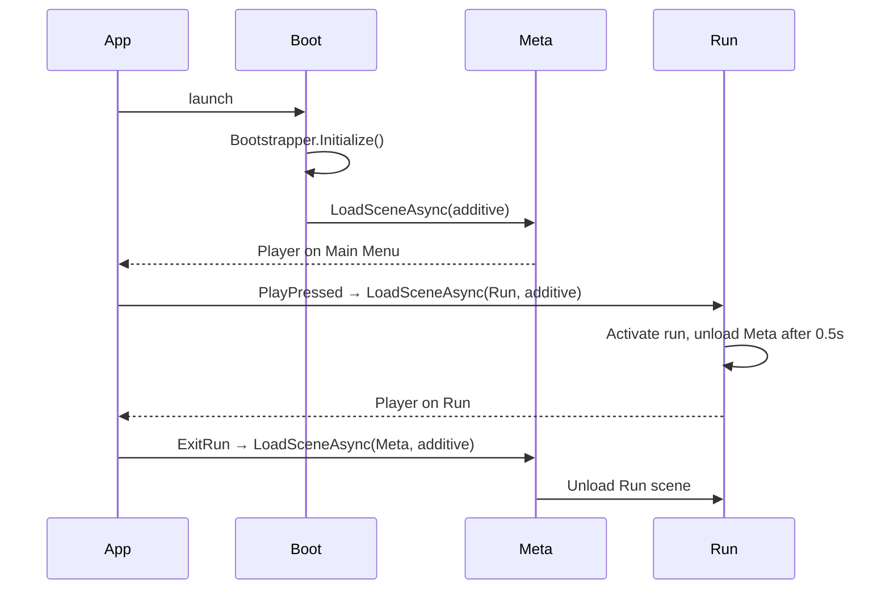

# 05 — Unity Scene Structure

## Scene Inventory

| Scene | Role | Load Type | Lifetime |
|---|---|---|---|
| `Boot` | Service bootstrap | Loaded first, never unloaded | App lifetime |
| `Meta` | Main menu / shop / missions | Additive | Until user enters Run |
| `Run` | Live gameplay | Additive | Until user exits run |
| `Biome_*` | Streamed biome chunks | Addressables, parented under streamer | Until streamer scrolls past |

## `Boot.unity` — Skeleton

```
Boot (scene)
└── Bootstrapper (GameObject)
    └── [Bootstrapper.cs]
        DontDestroyOnLoad → moved at runtime to a __DDOL__ root
```

`Bootstrapper.cs` registers every service then async-loads `Meta`. Nothing in `Boot` survives except the services.

## `Meta.unity` — Skeleton

```
Meta
├── --- CAMERAS ---
│   └── MainCamera (Cinemachine Brain)
│       └── CM_MetaMenu (vcam, framing menu)
├── --- UI ---
│   └── UIRoot (Canvas, Screen Space - Overlay)
│       ├── MainMenuView
│       ├── ShopView (disabled by default)
│       ├── MissionsView
│       ├── UpgradeView
│       ├── BattlePassView
│       └── PopupLayer
├── --- AMBIENT 3D ---
│   ├── HubScene (rotating slingshot vignette)
│   ├── Lighting (URP Volume)
│   └── AmbientAudio
└── --- BINDINGS ---
    └── MetaSceneBindings (component, injects services into views)
```

Sticky design rules:
- No gameplay logic in Meta. All logic runs in services.
- Use Unity 6's UI Toolkit + UGUI hybrid: Toolkit for static panels, UGUI for tweens.

## `Run.unity` — Skeleton

```
Run
├── --- WORLD ---
│   ├── BiomeStreamer (root for streamed chunks)
│   ├── Parallax (5 layers, each a flat plane with scrolling material)
│   ├── Launcher (current launcher prefab, swapped on tier change)
│   │   └── SpawnPoint
│   └── ProjectileRoot (pool parent)
│
├── --- CAMERAS ---
│   └── MainCamera (Cinemachine Brain, Blend = SmoothDamp 0.25s)
│       ├── CM_Aim (frames launcher + drag vector)
│       ├── CM_Flight (follows projectile, look-ahead)
│       ├── CM_SlowMo (tight on projectile, 65° FOV)
│       └── CM_EndRun (dolly orbit)
│
├── --- HUD ---
│   └── HUDRoot (Canvas, Screen Space - Camera)
│       ├── ComboLabel
│       ├── DistanceLabel
│       ├── CoinHud
│       ├── BoostButton
│       ├── PauseButton
│       └── EndRunPanel (disabled by default)
│
├── --- VFX ---
│   ├── ScreenShake (CinemachineImpulseSource)
│   ├── HitFlashLayer
│   └── PostProcessVolume (URP Volume, slow-mo tint)
│
├── --- AUDIO ---
│   ├── MusicSource_BiomeA
│   ├── MusicSource_BiomeB (crossfade buffer)
│   └── SFXPool
│
└── --- LOGIC ---
    └── RunController
        └── [RunController.cs, FSM]
```

## Biome Scene Convention (`Biome_Backyard.unity`)

Biome scenes are *content-only*. They contain:

```
Biome_Backyard (scene)
└── Chunk_Root
    ├── Chunk_000_Easy (prefab, 60m wide)
    ├── Chunk_001_Easy
    ├── Chunk_002_Medium
    └── Chunk_003_Boss
```

`BiomeStreamer` loads the scene additively, re-parents `Chunk_Root` into the run scene at the correct x offset, and unloads as the projectile passes.

## Camera Strategy

We use Cinemachine 3.1 with `CinemachineCamera` (the new component) per run state:

| Virtual Cam | Active When | Settings |
|---|---|---|
| `CM_Aim` | `Aiming` / `Charging` | Static framing of launcher, slight push-in on charge. |
| `CM_Flight` | `Flying` / `Boosted` | LookAhead time = `projectile.velocity.x * 0.4`, Damping (1.5, 1.5, 1). |
| `CM_SlowMo` | Slow-mo triggers | Higher priority during slow-mo, blends in 0.15s. |
| `CM_EndRun` | `Settling` → `Decision` | Dolly orbit around projectile, 4s rotation. |

State machine in `RunController` raises `EventBus<CameraStateChanged>` which a `CameraSwitcher` listens to and bumps `Priority` values.

## Lighting

URP single-pass forward, MSAA 4x off (post-process tricks instead). One main directional light per biome, baked light probes for ambient.

Each biome has a `Volume` profile (color grading LUT, bloom 0.35, vignette 0.2). Slow-mo overrides bloom + adds desaturation -10%.

## Loading Strategy



Total cold boot target: **≤ 2.0 s** on iPhone 12.
Run scene start (warm): **≤ 350 ms**.

## Performance Guardrails

- `Run` scene capped at **2,500** active scene objects (verified via custom validator).
- Each biome chunk **≤ 80** GameObjects, **≤ 12** dynamic lights (none usually).
- All transparent materials share two atlases (UI + VFX) to keep batch counts low.
